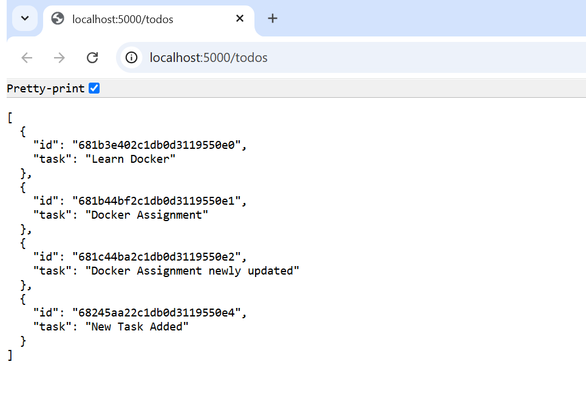

## 📝 TODO App (Flask + MongoDB) – Docker Assignment

This is a simple TODO REST API built using **Flask** and backed by **MongoDB**. The app is containerized using Docker and managed using Docker Compose.

## Environment Setup

Create a `.env` file in the root directory with the following content:

        MONGO_URI=mongodb://mongo:27017/todo_db

## Getting Started

Step 1: Clone the Repository
	git clone <your-repo-url>
	cd docker-containerize-todo-app

Step 2: Start the Application
	docker compose up --build

Step 3: Access the API
	http://localhost:5000/todos

## API Endpoints

GET all TODOs:
    curl http://localhost:5000/todos

POST a new TODO:
    curl -X POST -H "Content-Type: application/json" -d '{"task":"Buy groceries"}' http://localhost:5000/todos

PUT update a TODO (replace <id>):
    curl -X PUT -H "Content-Type: application/json" -d '{"task":"Buy fruits"}' http://localhost:5000/todos/<id>

DELETE a TODO (replace <id>):
    curl -X DELETE http://localhost:5000/todos/<id>

## Screenshots:

### ▶️ Flask App Running in Terminal

### 📬 POST / PUT / DELETE /todos Request in Postman/cURL
